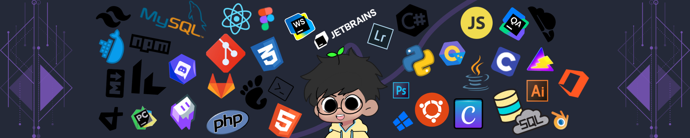

    

    <h1>
        
    </h1>

    <h3>S O C I A L S</h3>
    

        
        
        
        
    

    <h2>L A N G U A G E S</h2>
    

    <h2>GitHub Profile Summary Cards</h2>
    

        
        
        
        
        
    

