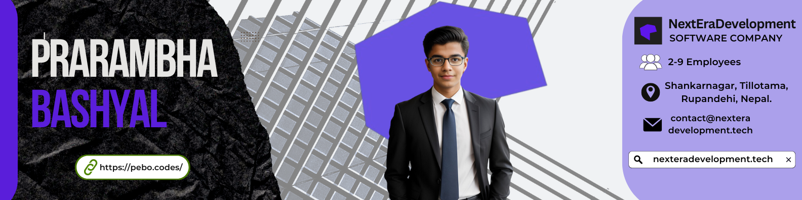

    <h1>
        
 
        
</h1>

    <h3>
      S O C I A L S 
    </h3>
    ㅤ
    
     
    ㅤ

    <h2>
        L A N G U A G E S                 &                 T O O L S
    </h2>
    
    </a>
    
    </a>
    
    </a>
    
    </a>
    
    </a>
      
    
    </a>
     
    </a>
    
    </a>
 
    </a>
 
    </a>
      
     
    </a>
     
    </a>
     
    </a>
     
    </a>
     
    </a>
      
 
    </a>
 
    </a>
 
    </a>
     
    </a>
 
    </a>

    

