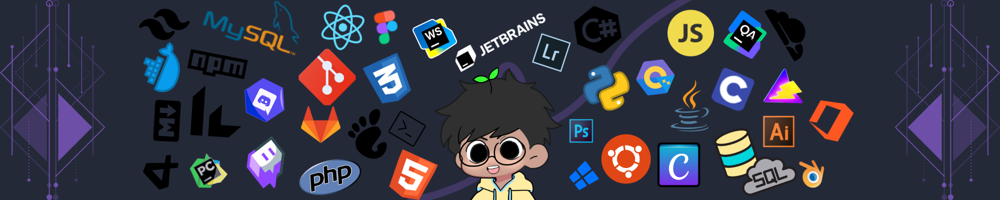

<div align="center">
    
</div>
<div align="center">
    
```zsh
┌─────────────────────────────────────────────────────────────────────────────┐
│                                                                            │
│   $ whoami                                                                  │
│   > prarambha bashyal · systems architect · ecosystem founder              │
│                                                                             │
│   $ cat /etc/location                                                      │
│   > butwal, nepal 🇳🇵                                                        │
│                                                                            │
│   $ echo $PHILOSOPHY                                                        │
│   > open source · privacy-first · build in public                          │
│                                                                             │
│   $ uptime                                                                 │
│   > 4+ years building · no signs of stopping                                │
│                                                                            │
└─────────────────────────────────────────────────────────────────────────────┘
```

<a href="https://prarambha.xyz">
  
</a>

</div>

<!-- WEATHER_START -->
<div align="center">

**Current Status:** Sleep = 0ms 💀 · 🌙 Clear Sky · 🌡️ 28.04°C · 📅 BS: 12 Baishakh, 2083

</div>
<!-- WEATHER_END -->

---

### `curl -I ftp://links` 

<div align="center">

[](https://user-badge.committers.top/nepal/Prarambha369) 

[](https://www.linkedin.com/in/misterbashyal/)
[](https://prarambha.xyz)
[](mailto:prarambha@butwalhacks.com)
[](https://butwalhacks.com)

[](https://github.com/sponsors/Prarambha369)


</div>

---


### `./about_me.sh` 

```bash
NAME="Prarambha Bashyal"
ALIAS=("Pebo CodeZ" "MisterBashyal")

ROLES=(
  "Ecosystem Founder        @ Butwal Hacks          [Mar'25-Present]"
  "Community Maintainer     @ GNOME Nepal           [Aug'24-Present]"
  "Former Lead              @ Hack Club Butwal      [Apr'25-Sep'25]"
)

PRIMARY_STACK=(
  "C++"        # systems programming, performance-critical applications
  "Python"     # scripting, automation, data processing
  "Next.js"    # fullstack web development (React-based)
  "SQL"        # database design and optimization
  "Git"        # version control, collaborative development
  "Linux"      # daily driver, system administration
  "Bash"       # shell scripting, automation workflows
)

echo "Building things that matter. From Nepal, for the world."
```

<br clear="both"/>

---

### `lscpu` 

```js
Architecture:        Full-Stack Systems Engineer
Byte Order:          Little Endian (performance-optimized)

── CORE COMPETENCIES ─────────────────────────────────────────────────────────
  Languages:     C++ · Python · JavaScript · TypeScript · SQL · Bash
  Frontend:      Next.js 14 · React · Tailwind CSS · shadcn/ui · Framer Motion
  Backend:       Node.js · Python · REST APIs · GraphQL
  Databases:     Supabase · PostgreSQL · MySQL
  Infrastructure: Vercel · Cloudflare · Linux · Git · GitHub Actions
  Design Tools:  Figma · Adobe Creative Suite · Blender

── SYSTEMS & LOW-LEVEL ───────────────────────────────────────────────────────
  C++ Development: Memory management, performance optimization, systems programming
  Linux/Unix: System administration, shell scripting, package management
  GNOME Desktop: Open source contributor, Linux desktop advocacy

── COMMUNITY & LEADERSHIP ────────────────────────────────────────────────────
  Founded: Butwal Hacks (regional student tech ecosystem)
  Maintains: GNOME Nepal (open source Linux community)
  Formerly Led: Hack Club Butwal (student developer community)
  Focus: Open source, privacy-first tools, free-tier infrastructure
```

<div align="center">

**── Primary Technologies ──**


**── Additional Technologies ──**


</div>

---

### `ps aux` 

```py
PrarambhaBashyal   001  99.9  prarambha.xyz                     [ACTIVE] Personal portfolio 
ParomBoat          002  85.0  sahuji-cashier                    [DEV] C++ POS system for local businesses
Wispy_GameZ        003  75.0  bagh-chal                         [OSS] Traditional Nepali board game
Pebo_CodeZ         004  65.0  tiger-bot                         [PROD] Discord automation bot
Prarambha369       005  60.0  butwal-hacks                      [FOUNDER] Student tech ecosystem
MisterBashyal      006  50.0  gnome-nepal                       [MAINTAINER] Open source community
```

---

### `df -h`

```js
Filesystem           Depth    Proficiency Level
/dev/systems         ████░    C++ · Memory Management · Performance Optimization
/dev/web             ████░    Next.js · React · Tailwind · Full-Stack Development
/dev/oss             ████░    Git · Linux · GNOME · Community Building
/dev/design          ███░░    Figma · Adobe Suite · UI/UX Design
/dev/automation      ███░░    Bash · Python · Scripting · Bots
/dev/leadership      ████░    Ecosystem Building · Team Leadership · Mentorship
```

---

### `cat /proc/metrics` 

<div align="center">
    


</div>

---

### `neofetch`

<div align="center">


<br/>


<br/>


</div>

---

### `tail -f /var/log/contributions`

<div align="center">
  <picture>
    <source media="(prefers-color-scheme: dark)" srcset="https://raw.githubusercontent.com/Prarambha369/Prarambha369/output/github-contribution-grid-snake-dark.svg">
    <source media="(prefers-color-scheme: light)" srcset="https://raw.githubusercontent.com/Prarambha369/Prarambha369/output/github-contribution-grid-snake.svg">
    
  </picture>
</div>

---

### `ssh pebo@hire.me`

<div align="center">
    
```lua
┌────────────────────────────────────────────────────────────────────┐
│                                                                    │
│   $ ssh pebo@butwalhacks.com                                       │
│   Connecting to prarambha@butwalhacks.com ...                     │
│   ██████████████████████████████ 100%                             │
│   Connection established. ✓                                        │
│                                                                    │
│   OPEN TO:                                                         │
│   → OSS Collaboration                                              │
│   → Fellowships                                                   │
│   → Internships (Full-Stack · Systems Engineering)                │
│   → Global Sponsorships                                            │
│                                                                    │
│   > ready to ship. when do we start?                              │
│                                                                    │
└────────────────────────────────────────────────────────────────────┘
```

```bash
$ echo "Before, I just wanted to know how it works."
Before, I just wanted to know how it works.

$ echo "Now, I want to change the way it works."
Now, I want to change the way it works.

$ █
```

</div>

---

### `man hire` 

```csv
NAME
       Prarambha Bashyal - Full-Stack Developer & Systems Engineer

SYNOPSIS
       hire prarambha --role={intern|fellow|contractor} --urgency=high

DESCRIPTION
       A self-taught developer with 4+ years of experience building production
       systems. Demonstrates exceptional technical depth (C++, systems programming)
       combined with modern web development skills (Next.js, React, TypeScript).

       Key Differentiators:
       • Founded and leads Butwal Hacks, a regional student tech ecosystem
       • Maintains GNOME Nepal, contributing to open source Linux desktop
       • Builds privacy-first, free-tier tools accessible globally
       • Proven track record of shipping production applications
       • Strong community leadership and mentorship experience

TECHNICAL SKILLS
       Languages:     C++, Python, JavaScript, TypeScript, SQL, Bash
       Web Stack:     Next.js 14, React, Tailwind CSS, shadcn/ui
       Databases:     Supabase, PostgreSQL, MySQL
       Infrastructure: Vercel, Cloudflare, Linux, Git, GitHub Actions
       Design:        Figma, Adobe Creative Suite, Blender

PROJECTS
       prarambha.xyz      → Personal portfolio
       sahuji-cashier     → C++ POS system for local businesses
       bagh-chal          → Open source traditional Nepali board game
       tiger-bot          → Discord community automation
       butwal-hacks       → Student tech ecosystem platform

AVAILABILITY
       Open to: Internships, Fellowships, OSS Collaboration, Remote Roles
       Location: Butwal, Nepal (UTC+5:75) - Priority "Remote"


AUTHOR
       Generated by automated recruitment pipeline v2.0

REPORTING BUGS
       This candidate has no known bugs. Performance issues not applicable.

COPYRIGHT
       © 2026 Prarambha Bashyal. All rights reserved.
```

</div>

---

<div align="center">

**Built with:** `Vim` · `Git` · `Coffee` · `Open Source Spirit` ☕💻

</div>

